# COA_Assignment1

# Question 1

***Gain in Performance with Respect to Various Methods***
| Method                                | Gain in Performance |
|---------------------------------------|---------------------|
| Recursion                             | 1.00                |
| Loop                                  | 62,446,610.17       |
| Recursion with Memoization            | 21,836,882.44       |
| Loop with Tabulation                  | 32,400,062.81       |

# Question 2

***CPU Time:*** CPU Time is the duration during which a computer's CPU actively processes a program's instructions, excluding time spent on input/output operations or other processes

***Meat Time:*** Meat Time refers to the core processing time during which the primary computation or logic of an algorithm is executed. It excludes overheads such as setup, I/O operations, and memory management, focusing solely on the time taken for the main computational tasks.

***System Time:*** System Time refers to the time spent by the operating system performing tasks on behalf of a process. This includes activities like I/O operations, system calls, and other operations managed by the OS that support the execution of the process but are not directly part of the process's own computations

## Part a

*The following table shows the CPU Time for the given matrix sizes for both C++ and Python programs with integer and float data types.*

| Matrix Size | C++ Time integer data-type(seconds) | C++ Time float data-type(seconds) | Python Time int data-type (seconds) | Python Time float data-type (seconds) |
|-------------|-------------------------------------|------------------------------------|--------------------------------------|-----------------------------------------|
| 64          | 0.004160                            | 0.003560                           | 0.005208                            | 0.014000                                |
| 128         | 0.043302                            | 0.029386                           | 0.062500                             | 0.104000                                |
| 256         | 0.341350                            | 0.260879                           | 0.557291                             | 0.846000                                |
| 512         | 2.680143                            | 2.672749                           | 6.385416                             | 7.460000                                |
| 1024        | 17.713814                           | 20.755233                           | 55.015625                            | 69.344000
    

## Part b

    

        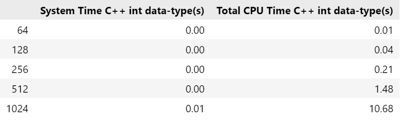
    

    

        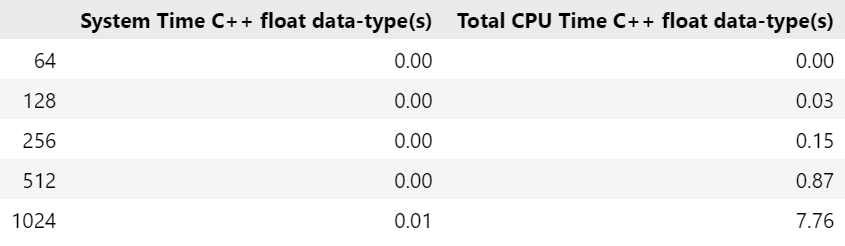
    

 

    

        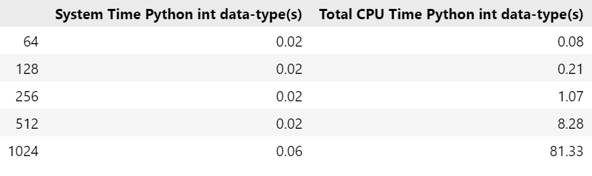
    

    

        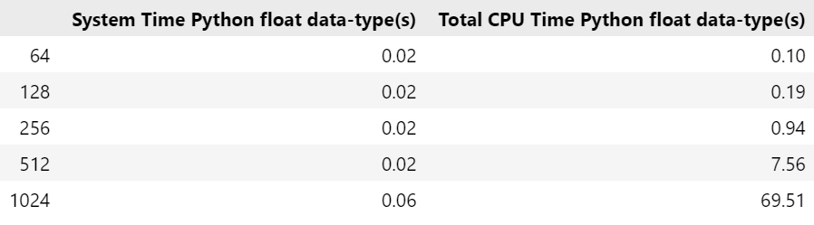
    

*The following table shows the Meat Time for the given matrix sizes for both C++ and Python programs with integer and float data types.*

### Meat Time Proportion for C++ Integer Data-Type

| Matrix Size | Meat Time (seconds) | Meat Time Proportion (%) |
|-------------|---------------------|--------------------------|
| 64          | 0.005354             | 53.54%                   |
| 128         | 0.030016             | 75.04%                   |
| 256         | 0.178672             | 85.08%                   |
| 512         | 1.404920             | 94.93%                   |
| 1024        | 10.446800            | 97.82%                   |

### Meat Time Proportion for C++ Double Data-Type

| Matrix Size | Meat Time (seconds) | Meat Time Proportion (%) |
|-------------|---------------------|--------------------------|
| 64          | 0.002582             | 0.00%                    |
| 128         | 0.027640             | 92.13%                   |
| 256         | 0.131547             | 87.70%                   |
| 512         | 0.821069             | 94.38%                   |
| 1024        | 7.630140             | 98.33%                   |

### Meat Time Proportion for Python Integer Data-Type

| Matrix Size | Meat Time (seconds) | Meat Time Proportion (%) |
|-------------|---------------------|--------------------------|
| 64          | 0.0145810            | 18.23%                   |
| 128         | 0.120020             | 57.15%                   |
| 256         | 0.974026             | 91.03%                   |
| 512         | 8.176262             | 98.75%                   |
| 1024        | 81.150830            | 99.78%                   |

### Meat Time Proportion for Python Float Data-Type

| Matrix Size | Meat Time (seconds) | Meat Time Proportion (%) |
|-------------|---------------------|--------------------------|
| 64          | 0.0136759            | 13.68%                   |
| 128         | 0.1038770            | 54.67%                   |
| 256         | 0.845764             | 89.97%                   |
| 512         | 7.459630             | 98.67%                   |
| 1024        | 69.344414            | 99.76%                   |

*The following plot shows the Meat Time Proportion for the given matrix sizes for both C++ and Python programs with integer and float data types.*

    

        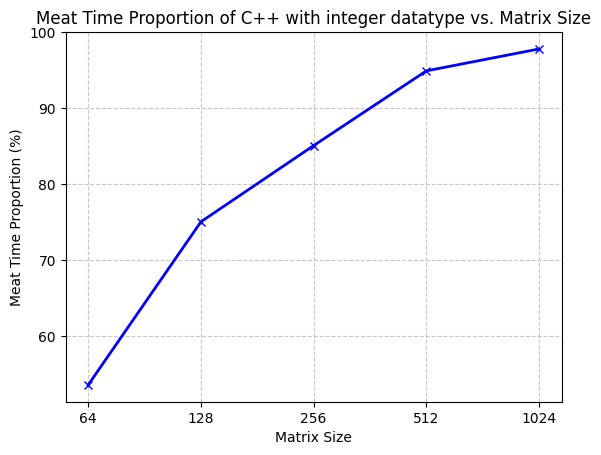
    

    

        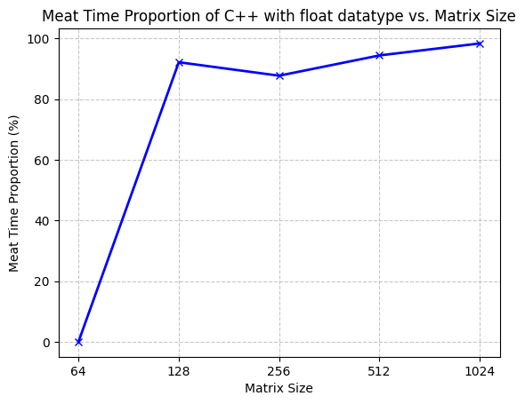
    

    

        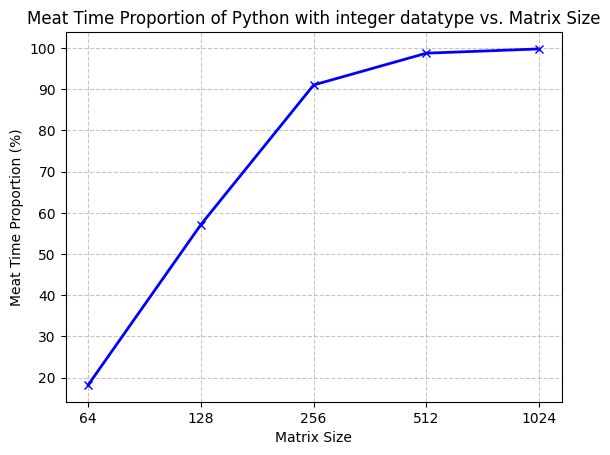
    

    

        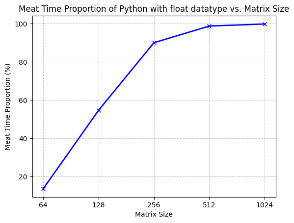
    

***Conclusion:***
- The Meat Time proportion will increase as the matrix size increases for both C++ and Python programs because the number of operations will increase with the size of the matrix.

## part c
***Comparison of C++ and Python Programs with integer data-type***

    

        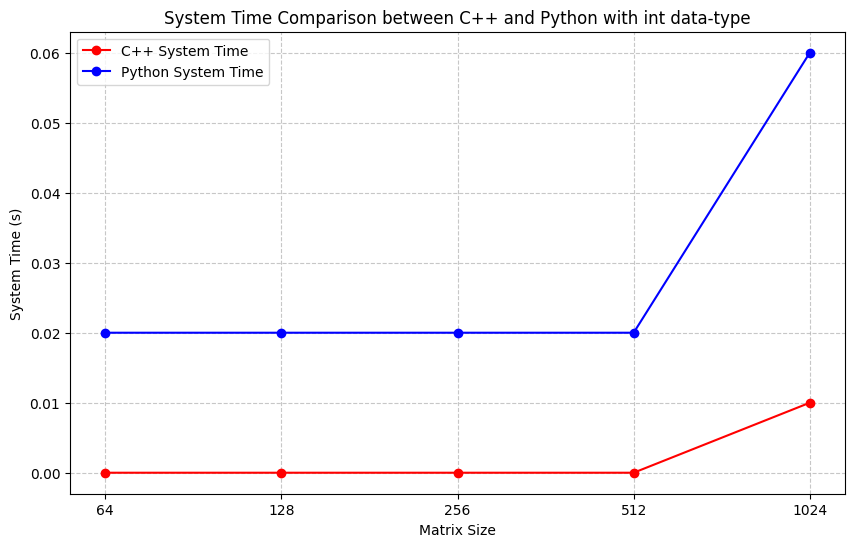
    

    

        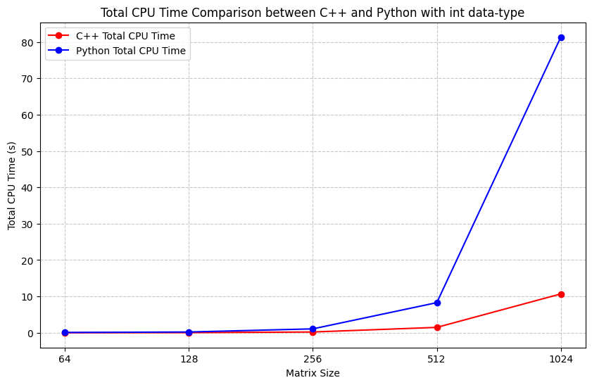
    

***Comparison of C++ and Python Programs with float data-type***

    

        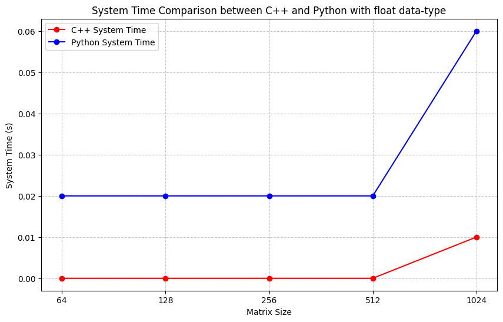
    

    

        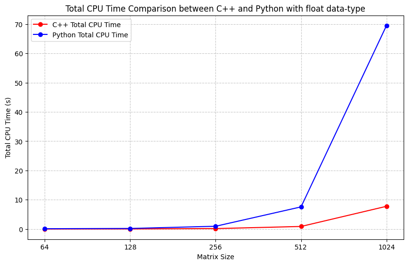
    

### ***Conclusion:***

- The CPU Time for C++ is significantly lower than Python for both integer and float data types. This is because C++ is a compiled language and is generally faster than Python, so C++ programs execute faster than Python programs because the performance is inversely proportional to the CPU Time.
- The Meat Time proportion will increase as the matrix size increases for both C++ and Python programs because the number of operations will increase with the size of the matrix.

